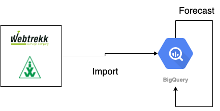

## audev.kennzahlenupdate

### Functionality

This repo builds the foundation for the daily Kennzahlenupdate report. 
It consists of two parts:

* import
* forecast

The _import_ part takes care of importing all necessary data from various 
sources. The _forecast_ part takes care of the monthly forecast generated from the IVW 
data. Both parts share common code, however they are treated as seperate applications 
to keep the flexibility of executing them standalone. 

### Design diagram



### Local development guide
##### Installation

For local execution you need following prerequisites:
* `python >= 3.7`
* `docker`
* `docker-compose`
* Authentication file for Google Service Account. You'll find it under `zon/v1/gcp/audev-217815/service-account-keys/kennzahlenupdate-owner` in Vault. Save the value as a `audev-217815-kennzahlenupdate-owner.json` and put it on the README.md level.
* `.env` file with following content:

```
➜ .env
WT_USER=<vault: zon/v1/gcp/audev-217815/webtrekk/api/user>
WT_PASSWORD=<vault: zon/v1/gcp/audev-217815/webtrekk/api/password>
WT_CUSTOMER_ID=<vault: zon/v1/gcp/audev-217815/webtrekk/api/customer_id>

F3_CLIENT_ID=<vault: zon/v1/gcp/audev-217815/folge3/reshin/client_id>
F3_CLIENT_SECRET=<vault: zon/v1/gcp/audev-217815/folge3/reshin/client_secret>

GOOGLE_APPLICATION_CREDENTIALS=audev-217815-kennzahlenupdate-owner.json
```

##### Usage

You can run both parts seperately in a docker container with `make docker-import` or `make docker-forecast` respectively.

### Deployment description

Deployment is run as a deployment pipeline via Drone and described in `.drone.yml`. It consists of two steps, building the docker image and deploying it as a cronjob to Kubernetes. You'll find all job descriptions in `/k8s`. Deployment is automatically triggered by every push to `master`.

### Operations guide
/